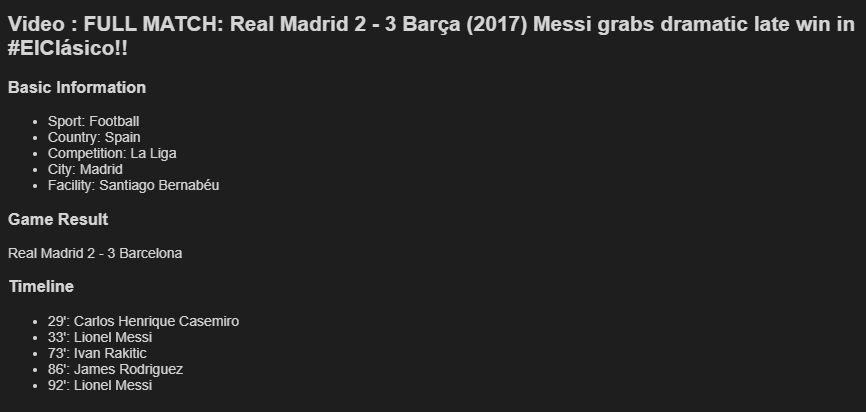

# Introduction

In the vast and dynamic world of sports, key moments often define games and fuel discussions among fans and analysts alike. However, sifting through hours of video to find these pivotal events can be time-consuming and labor-intensive. By leveraging the synergy of audio-to-text technology, like Whisper, and LLM, we can **automate** the detection of these key moments, transforming how content is curated and consumed. This innovative approach not only enhances the viewer's experience by delivering concise summaries and highlights but also opens new ways for data-driven sports analysis and storytelling.

- Medium article: [link](https://)
- GitHub repo: [link](https://github.com/snassimr/sport_info_retrieval)


# Setup environment

1. Setup conda environment

    1.1 Install miniconda

    ```
    wget https://repo.anaconda.com/miniconda/Miniconda3-py310_23.9.0-0-Linux-x86_64.sh  .
    chmod +x Miniconda3-py310_23.9.0-0-Linux-x86_64.sh
    source ~/.bashrc
    # validate installation
    conda env list
    ```

    1.2 Create conda environment

    ```
    conda create -n sport_info_retrieval python=3.10
    conda activate sport_info_retrieval
    pip install -r requirements.txt
    ```

2. Download and prepare pre-trained audio-to-text model

    2.1 Download model from Hugging Face

    See [here](https://huggingface.co/docs/hub/en/models-downloading) or run these commands in Jupyter cell :

    ```
    !pip install huggingface_hub
    from huggingface_hub import login
    login(token = "put_your_hugging_face_here", add_to_git_credential=True)
    model_hf_path = 'https://huggingface.co/openai/whisper-medium.en' # adjust for model you'd like to use
    !git clone {model_hf_path}

    # archive folder to copy folder to target location
    !zip -r whisper-medium.en.zip whisper-medium.en -x "whisper-medium.en/.git/*"
    ```
    Unarchive zip to get model folder and copy it to to sport_info_retrieval/models.

    2.2 Adjust configuration - set AUDIO_TO_TEXT_MODEL_FOLDER and AUDIO_TO_TEXT_MODEL_NAME in config.yaml

    2.3 Perform installs on Linux

    ```
    sudo apt update
    sudo apt install ffmpeg
    ```

# Retrieve Info

```
info = get_info(prompt)
```

```
display_info(info, VIDEO_NAME)
```




